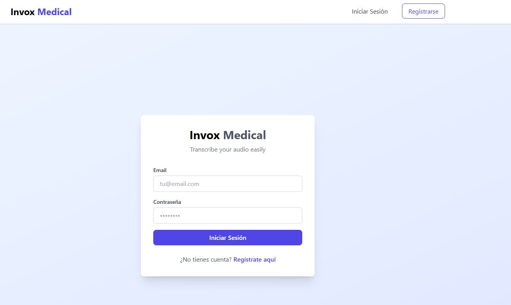
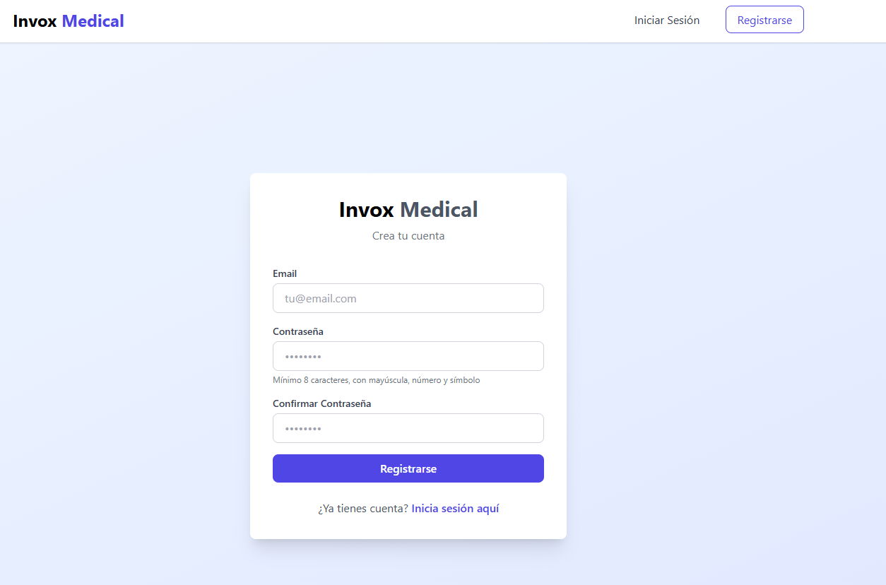
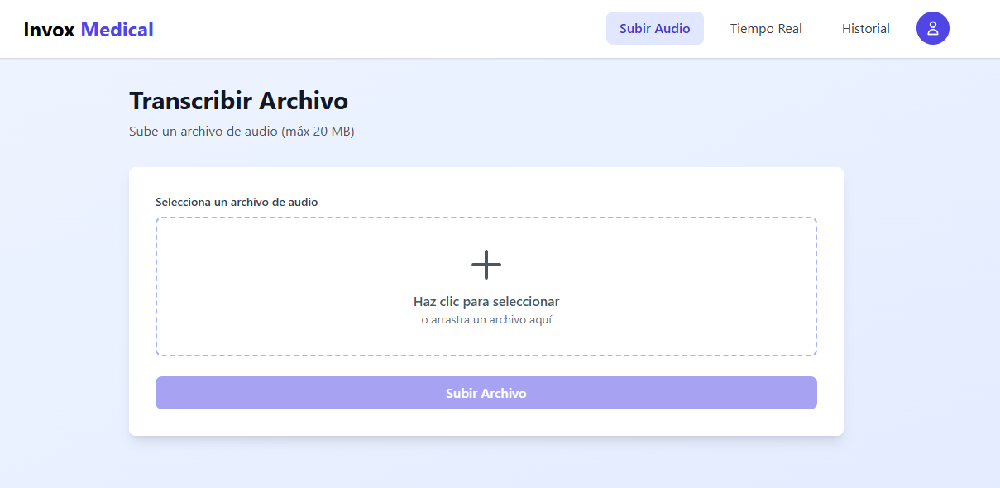
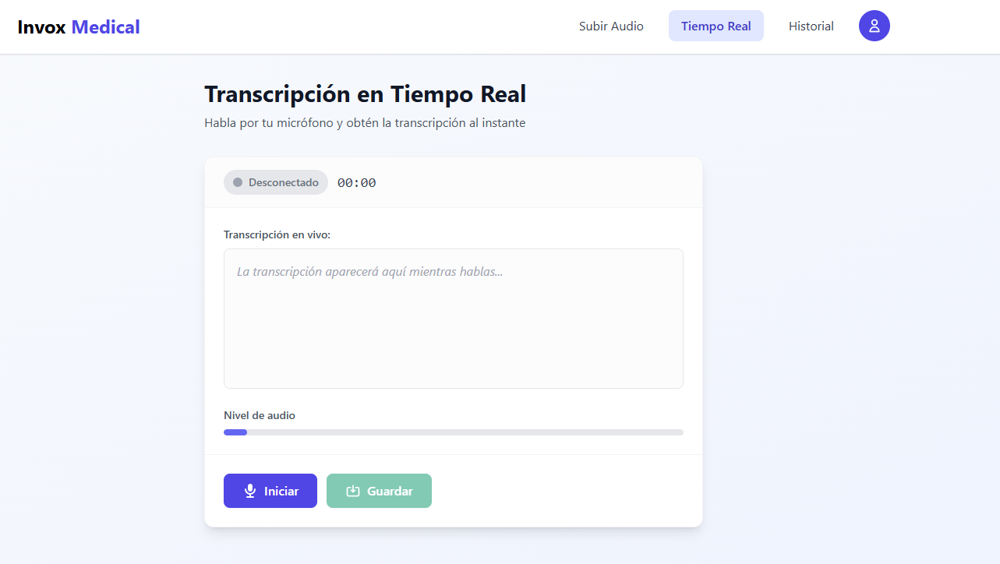
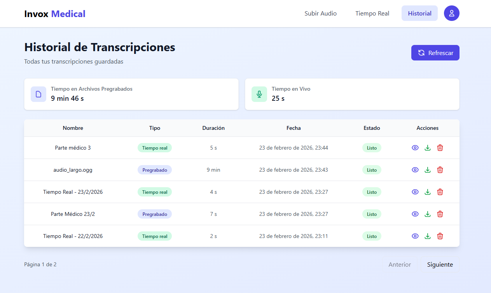

# 🎙️ Transcription App - Vocali

Plataforma de transcripción de audio en la nube desarrollada para la prueba técnica de Vocali. Permite a usuarios registrados transcribir archivos de audio y realizar transcripciones en tiempo real desde el micrófono.

## 📍 Enlace para probar

**URL de producción:** [https://transcription-app-client.vercel.app/](https://transcription-app-client.vercel.app/)

---

## 📸 Capturas de pantalla

| Funcionalidad                    | Captura                                    |
| -------------------------------- | ------------------------------------------ |
| **Login**                        |        |
| **Registro**                     |  |
| **Subida de archivo**            |      |
| **Transcripción en tiempo real** |  |
| **Historial**                    |    |

> **Nota:** Sube las capturas de pantalla en `docs/screenshots/` con los nombres indicados (login.png, register.png, upload.png, realtime.png, history.png).

---

## 📋 Tabla de contenidos

- [Funcionalidades](#-funcionalidades)
- [Stack tecnológico](#-stack-tecnológico)
- [Arquitectura y patrones de diseño](#-arquitectura-y-patrones-de-diseño)
- [DDD y documentación para agentes IA](#-ddd-y-documentación-para-agentes-ia)
- [Servicios AWS](#-servicios-aws)
- [Cómo levantar la aplicación](#-cómo-levantar-la-aplicación)
- [Tests](#-tests)
- [CI/CD](#-cicd)
- [Estructura del proyecto](#-estructura-del-proyecto)

---

## ✨ Funcionalidades

- **Registro:** Alta en la plataforma para usar servicios de transcripción
- **Autenticación:** Login con email y contraseña (AWS Cognito)
- **Cerrar sesión:** Logout para usuarios autenticados
- **Transcripción por archivo:** Subida de audios hasta 20 MB mediante URLs pre-firmadas de S3
- **Transcripción en tiempo real:** Transcripción en vivo desde el micrófono (Speechmatics WebSocket)
- **Historial:** Listado paginado de transcripciones (10 elementos por página)
- **Descarga:** Descarga de transcripciones en formato texto

---

## 🛠 Stack tecnológico

### Backend

| Tecnología               | Versión | Propósito                                                  |
| ------------------------ | ------- | ---------------------------------------------------------- |
| **Node.js**              | 18.x    | Runtime                                                    |
| **TypeScript**           | 5.x     | Tipado estático                                            |
| **Serverless Framework** | 4.x     | IaC (Infraestructura como Código), orquestación de Lambdas |
| **AWS Lambda**           | -       | Unidades computacionales serverless                        |
| **DynamoDB**             | -       | Base de datos NoSQL                                        |
| **S3**                   | -       | Almacenamiento de archivos de audio                        |
| **Cognito**              | -       | Autenticación y gestión de usuarios                        |
| **Jest**                 | 29.x    | Pruebas unitarias y de integración                         |

### Frontend

| Tecnología       | Versión | Propósito                                      |
| ---------------- | ------- | ---------------------------------------------- |
| **Nuxt.js**      | 4.x     | Framework full-stack Vue                       |
| **TypeScript**   | -       | Tipado estático                                |
| **Tailwind CSS** | 6.x     | Framework de estilos (vía @nuxtjs/tailwindcss) |
| **Pinia**        | 3.x     | Gestión de estado                              |
| **VueUse**       | 14.x    | Utilidades reactivas                           |
| **Vitest**       | 2.x     | Pruebas unitarias                              |
| **Cypress**      | 13.x    | Pruebas E2E                                    |

### Servicios externos

- **Speechmatics:** API de transcripción (batch y tiempo real), con capa gratuita

---

## 🏛 Arquitectura y patrones de diseño

### Por qué Arquitectura Hexagonal (Ports & Adapters)

Se eligió la arquitectura hexagonal para:

1. **Desacoplamiento:** El dominio no depende de AWS ni de infraestructura concreta.
2. **Testabilidad:** Los use cases se prueban con mocks; no hace falta levantar DynamoDB o Cognito.
3. **Sustituibilidad:** Cambiar DynamoDB por otra base de datos implica solo adaptar repositorios.
4. **Alineación con DDD:** Dominio bien definido, bounded contexts claros.

El flujo de dependencias es:

```
Presentation → Application → Domain ← Infrastructure
```

Solo `Infrastructure` implementa interfaces definidas en el dominio.

### Por qué Serverless (Lambda)

- **Coste:** Sin uso, coste cercano a cero; pago por invocación.
- **Escalabilidad:** Escala automática sin gestión de servidores.
- **Integración:** Conexión directa con Cognito, DynamoDB, S3 y API Gateway.

### Por qué Event-Driven para transcripciones

Las transcripciones largas pueden superar el timeout de Lambda. El flujo es:

1. Cliente solicita URL pre-firmada.
2. Cliente sube el archivo directamente a S3.
3. S3 dispara un evento → Lambda procesa el audio.
4. Lambda envía el trabajo a Speechmatics y responde de inmediato.
5. Speechmatics envía un webhook al terminar → Lambda actualiza DynamoDB.

El frontend hace polling o websockets para mostrar el estado sin bloquear.

### Por qué paginación por cursor en DynamoDB

DynamoDB no soporta offset de forma eficiente. Con cursor-based pagination:

- La siguiente página depende de `LastEvaluatedKey`.
- Complejidad O(1) en lugar de O(n).

### Patrones usados

| Patrón                        | Uso                                            |
| ----------------------------- | ---------------------------------------------- |
| **Repository**                | Abstracción del acceso a datos (DynamoDB)      |
| **Adapter**                   | Integración con Cognito, S3, Speechmatics      |
| **Use Case**                  | Orquestación de la lógica de negocio           |
| **DTO**                       | Objetos de transferencia entre capas           |
| **Inyección de dependencias** | Use cases reciben repositorios por constructor |

---

## 📚 DDD y documentación para agentes IA

El proyecto usa **Domain-Driven Design** con bounded contexts:

1. **Auth Context:** Registro, login, logout (usuarios y Cognito).
2. **Transcription Context:** Upload, transcripción batch y en tiempo real.
3. **History Context:** Listado, descarga y eliminación de transcripciones.

### Documentos para agentes de IA (Cursor, Cline, etc.)

La carpeta `docs/` contiene documentos pensados para que los agentes de IA mantengan coherencia con la arquitectura:

| Documento                                                              | Contenido                                                                |
| ---------------------------------------------------------------------- | ------------------------------------------------------------------------ |
| [`docs/ARCHITECTURE.md`](docs/ARCHITECTURE.md)                         | Arquitectura hexagonal, flujos, ADRs, stack                              |
| [`docs/PROJECT_STRUCTURE.md`](docs/PROJECT_STRUCTURE.md)               | Estructura del backend (dominio, aplicación, infraestructura) y frontend |
| [`docs/PROJECT_STRUCTURE_CLIENT.md`](docs/PROJECT_STRUCTURE_CLIENT.md) | Árbol del cliente Nuxt y convenciones                                    |
| [`docs/API_SPECIFICATION.md`](docs/API_SPECIFICATION.md)               | Endpoints, parámetros, códigos de error                                  |
| [`docs/DATABASE_SCHEMA.md`](docs/DATABASE_SCHEMA.md)                   | Esquema de tablas DynamoDB                                               |
| [`docs/CODING_STANDARDS.md`](docs/CODING_STANDARDS.md)                 | Tipado, nombres, errores, path aliases                                   |
| [`docs/DEPLOYMENT.md`](docs/DEPLOYMENT.md)                             | Despliegue a producción y verificación                                   |

Estos archivos sirven como contexto para que las herramientas de IA respeten las reglas del proyecto y generen código coherente.

---

## ☁️ Servicios AWS

| Servicio        | Uso                                                                                        |
| --------------- | ------------------------------------------------------------------------------------------ |
| **Lambda**      | API REST (auth, transcripciones, listado, descarga, webhooks), procesamiento de eventos S3 |
| **API Gateway** | Exposición HTTP de las Lambdas, CORS, autorización Cognito                                 |
| **DynamoDB**    | Tablas: `vocali-users`, `vocali-transcriptions`, `vocali-job-mapping`                      |
| **S3**          | Bucket para audios (`uploads/`) y transcripciones finales                                  |
| **Cognito**     | User Pool para registro, login y JWT                                                       |

### Tablas DynamoDB

- **vocali-users:** Usuarios (PK: userId, GSI: email-index)
- **vocali-transcriptions:** Transcripciones (PK: userId, SK: id, GSI: status-index, createdAt-index)
- **vocali-job-mapping:** Mapeo job_id Speechmatics ↔ transcription_id

---

## 🚀 Cómo levantar la aplicación

### Requisitos previos

- **Node.js** 18.x
- **pnpm** 9.x
- **Docker** o **Podman** (para DynamoDB local)

### 1. Clonar e instalar dependencias

```bash
git clone https://github.com/juanisabba/transcription-app.git
cd transcription-app
pnpm install
```

### 2. Variables de entorno

Copia los ejemplos y configura valores locales:

```bash
cp api/.env.example api/.env.local
cp client/.env.example client/.env
```

Configura en `api/.env.local` y `client/.env`:

- `SPEECHMATICS_API_KEY` — API key de Speechmatics (capas gratuitas disponibles)
- `COGNITO_USER_POOL_ID` y `COGNITO_CLIENT_ID` — Valores de tu User Pool (o del desplegado)
- `DYNAMODB_*` — Tablas (en local: `vocali-users-dev`, `vocali-transcriptions-dev`, etc.)

Para desarrollo local con DynamoDB local:

```bash
DYNAMODB_ENDPOINT=http://localhost:8000
DYNAMODB_USERS_TABLE=vocali-users-dev
DYNAMODB_TRANSCRIPTIONS_TABLE=vocali-transcriptions-dev
DYNAMODB_JOB_MAPPING_TABLE=vocali-job-mapping-dev
```

### Levantar con Docker

#### DynamoDB Local (para desarrollo)

```bash
cd api
pnpm run dynamo:up
```

> Si usas **Docker** en lugar de Podman, ejecuta manualmente: `docker compose up -d dynamodb-local` desde `api/`. El contenedor DynamoDB escucha en `http://localhost:8000`.

#### Inicializar tablas locales

```bash
pnpm run setup:local-db
```

#### Imagen de build (lint + build)

```bash
docker build -t transcription-app .
```

Esta imagen valida lint y build del monorepo.

---

### Levantar en local (sin Docker para API)

#### 1. DynamoDB Local

```bash
cd api
pnpm run dynamo:up
pnpm run setup:local-db
```

#### 2. API (Serverless Offline)

```bash
pnpm run dev:api
```

La API queda en `http://localhost:3001`.

#### 3. Cliente Nuxt

```bash
pnpm run dev:client
```

El cliente queda en `http://localhost:3000`.

#### 4. Ambos a la vez

```bash
pnpm run dev
```

### Notas para transcripciones batch en local

Para transcripciones por archivo, el webhook de Speechmatics debe alcanzar tu API. Opciones:

- Usar **ngrok** (o similar) y configurar `SPEECHMATICS_WEBHOOK_URL` en `api/.env.local`.
- O usar directamente la API desplegada en producción si solo desarrollas frontend.

---

## 🧪 Tests

### Backend (Jest)

```bash
# Tests unitarios
pnpm --filter api run test

# Con cobertura
pnpm run test:coverage:api
```

Ubicación: `api/src/application/use-cases/**/__tests__/*.test.ts`, `tests/presentation/**/*.test.ts`, `tests/integration/**/*.test.ts`.

### Frontend (Vitest)

```bash
pnpm --filter client run test

# Con cobertura
pnpm run test:coverage:client
```

### E2E (Cypress)

```bash
# Modo interactivo
pnpm run test:e2e:open

# Modo headless
pnpm run test:e2e
```

Especificaciones en `cypress/e2e/` (landing, auth, navegación, transcribe-upload).

### Todos los tests

```bash
pnpm run test
```

---

## 🔄 CI/CD

### Pipeline CI (`.github/workflows/ci.yml`)

- **Lint & type-check:** ESLint, `tsc --noEmit` en API.
- **Tests unitarios:** Jest con cobertura.
- **Tests de integración:** DynamoDB Local en contenedor.
- **Build:** Compilación de API y cliente.

Se ejecuta en pushes y PRs a `main`, `master` y `develop`.

### Pipeline Deploy (`.github/workflows/deploy.yml`)

- **Despliegue a producción** al hacer push a `main`.
- Ejecuta tests, lint, build y despliega con Serverless (`--stage prod`).
- Requiere secrets: `AWS_ACCESS_KEY_ID`, `AWS_SECRET_ACCESS_KEY`, `SPEECHMATICS_API_KEY`, etc.

---

## 📁 Estructura del proyecto

```
transcription-app/
├── api/                    # Backend Serverless
│   ├── src/
│   │   ├── domain/         # Entidades, repositorios (interfaces)
│   │   ├── application/   # Use cases
│   │   ├── infrastructure/ # Repos, adapters (Cognito, S3, Speechmatics)
│   │   ├── presentation/   # Handlers Lambda (HTTP, eventos S3, webhooks)
│   │   └── shared/         # Utilidades, constantes, errores
│   ├── serverless.yml      # IaC: Lambdas, DynamoDB, S3, Cognito
│   └── docker-compose.yml  # DynamoDB Local
├── client/                 # Frontend Nuxt
│   └── src/
│       ├── components/
│       ├── composables/
│       ├── pages/
│       ├── stores/
│       └── services/
├── docs/                   # Documentación y screenshots
├── tests/                  # Tests compartidos (handlers, integración)
├── cypress/                # Tests E2E
├── scripts/                # setup-local-db, etc.
└── package.json            # Monorepo scripts
```

---

## 📖 API

| Método | Endpoint                             | Descripción                          |
| ------ | ------------------------------------ | ------------------------------------ |
| POST   | `/auth/register`                     | Registro                             |
| POST   | `/auth/login`                        | Login                                |
| POST   | `/auth/logout`                       | Logout                               |
| POST   | `/transcriptions/upload`             | URL pre-firmada para subir audio     |
| POST   | `/transcriptions/{id}/confirm`       | Confirmar subida                     |
| POST   | `/transcriptions/realtime`           | Sesión transcripción en tiempo real  |
| POST   | `/transcriptions/realtime/{id}/save` | Guardar transcripción en tiempo real |
| GET    | `/transcriptions`                    | Listar transcripciones (paginado)    |
| GET    | `/transcriptions/{id}/download`      | URL de descarga                      |
| DELETE | `/transcriptions/{id}`               | Eliminar transcripción               |

Detalles en [`docs/API_SPECIFICATION.md`](docs/API_SPECIFICATION.md).

---

## 📄 Licencia

ISC
